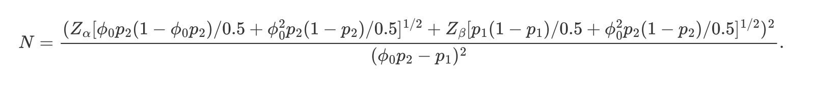

```{r setup, include=FALSE}
knitr::opts_chunk$set(echo = FALSE)
library(glmmTMB)
library(tidyverse)
library(readxl)
library(flexsurv)
data= readxl::read_excel("Q2b.xlsx")
baseline = readxl::read_excel("Q2b_BL.xlsx")
data_all = left_join(data, baseline, by = "ID") %>% 
  janitor::clean_names() %>% 
  mutate(time = factor(time),
         sex = factor(sex, level = c(0,1),
                      label = c("female","male")),
         group = factor(group, levels = c(0,1),
                        labels = c("control", "vaccine"))
         ) 
```

# Outline

* Vaccine efficacy protocol
* Adverse effect analysis for Vaccine v.s. Control
* Survival analysis COVID contraction after vaccine shot

# Backgroud

* Coronavirus, the severe acute respiratory syndrome coronavirus 2 (SARS-CoV-2), has had devastating consequences globally. 

* Control measures, such as the use of masks, have been variably implemented and have proved insufficient in impeding the spread of coronavirus disease 2019 (Covid-19), the disease caused by SARS-CoV-2. 

* Vaccines are urgently needed to reduce the morbidity and mortality associated with Covid-19. 

# Vaccine efficacy protocol

* A pharmaceutical company therefore would like to conduct a phase III randomized (**1-to-1 ratio**), **stratified**, observer-blinded, placebo-controlled trial at **100 U.S. sites** to demonstrate the efficacy for their developing vaccine. 

## Define primary outcome

$$
    VE = 1-\frac{p_1}{p_2}
$$

* $p_i$ : the number of new cases during 12 months over the total number at risk during 12 months in group i
* $x_i$ cases in group i with $n_i$ samples

* Goal: test the null hypothesis that the vaccine efficacy is 30% or less and provide 80% power to detect a 60% vaccine efficacy without planned interim analyses

# Vaccine efficacy protocol -- randomization procedure

* The study consists of **2 periods** :
  * Vaccine period for 2 injections
  * Follow up period: 
    * Second injection - 14 days: if the subjects have symptoms/being positive at this period, regard as not at risk and will not contribute to the efficacy calculation
    * 12 months: follow up period,
    
# Vaccine efficacy protocol -- randomization procedure

* Collect study subjects with seronegative at baseline $N_0$
* Take 2 covid shots 
* Collect status at day 14 after second shot
* Remove those becoming positive during the 14 days
* Count new cases during 12 months

# Vaccine efficacy protocol -- randomization procedure

* Blinding and Randomization procedure
  * The Phase III clinical trial will be conducted in multicenter, randomized, stratified, observer-blinded, and placebo-controlled design
  * There are 100 participating centers in the US
  * Eligible participants are those aged 16 years or older who tested seronegative for SARS-CoV-2 at the recruitment time
  * We stratify the participants by age and gender, and randomly assigned persons in each stratification in a 1:1 ratio to receive either two doses of vaccines or placebo
  * They will be monitored for 12 months by active surveillance of COVID-19.
  * The trial is observer-blinded to avoid introducing bias, i.e, the participants and those responsible for the evaluation are blinded to the treatment group

# Vaccine efficacy protocol -- analysis approach

* $H_0:VE\leq30\%, H_1: VE>30\%$
* Test stat: 

\[
    Z = \frac{\phi_0 \widehat{p}_2 - \widehat{p}_1}{\sqrt{\frac{\widetilde{p}_1(1-\widetilde{p}_1)}{n_1} + \phi_0^2 \frac{\widetilde{p}_2(1-\widetilde{p}_2)}{n_2}}},
\]

where $\phi_0 = 1 - \mathrm{VE}_0, \widehat{p}_1 = \frac{x_1}{n_1},\widehat{p}_2 = \frac{x_2}{n_2},$
and $\widetilde{p}_1$ and $\widetilde{p}_2$ are the maximum likelihood estimates under the null hypothesis, calculated by
\[
    \widetilde{p}_1 = \phi_0 \widetilde{p}_2,
    \qquad 
    \widetilde{p}_2 = \frac{-B - \sqrt{B^2 - 4AC}}{2A},
\]
where
\[
    A = (n_1+n_2) \phi_0,
    \qquad 
    B = -(n_1 \phi_0 + x_1 + n_2 + x_2 \phi_0),
    \qquad 
    C = x_1 + x_2,
\]
and we reject the null hypothesis if $Z > Z_\alpha$, the upper $\alpha$-th percentile of a standard normal distribution.

# Vaccine efficacy protocol -- sample size calculation
To detect a vaccine efficacy of $\mathrm{VE}_1 = 0.6$ (or vaccine event probability of $p_{1} = 0.4 p_2$) with $1 - \beta = 80\%$ power, we assume that $n_1 = n_2$, and the number of subjects needed will be determined by the following formula:



\begin{table}[ht]
\centering
\begin{tabular}{c|cccccccccc}
   & 0.01 & 0.02 & 0.03 & 0.04 & 0.05 & 0.06 & 0.07 & 0.08 & 0.09 & 0.10 \\\hline
  0.00 & 18952 & 9400 & 6216 & 4624 & 3668 & 3032 & 2578 & 2236 & 1970 & 1758 \\
  0.05 & 19950 & 9894 & 6544 & 4868 & 3862 & 3192 & 2712 & 2354 & 2074 & 1850 \\
  0.10 & 21058 & 10444 & 6906 & 5138 & 4076 & 3368 & 2864 & 2484 & 2190 & 1954 \\
  0.15 & 22296 & 11058 & 7312 & 5440 & 4316 & 3568 & 3032 & 2630 & 2318 & 2068 \\
  0.20 & 23690 & 11750 & 7770 & 5780 & 4586 & 3790 & 3222 & 2794 & 2464 & 2198 \\
\end{tabular}
\caption{Sample size calculation changing missing rate(row) and control prevalence(column)}
\end{table}


# Adverse effect analysis for Vaccine v.s. Control


# Adverse effect analysis for Vaccine v.s. Control

```{r echo=FALSE, fig.height=6, message=FALSE, warning=FALSE}
data_all %>% 
  mutate(age_group = cut(age,3)) %>% 
  group_by(sex, age_group, group, time) %>% 
  summarize(mean_sae = mean(sae, na.rm = T)) %>% 
  ggplot(aes(x = time, y = mean_sae, fill = group))+
  geom_bar(stat = "identity", position = "dodge")+
  facet_grid(sex~age_group)+
  labs(title = "Mean SAE across time by sex and age group")
```


# Adverse effect analysis for Vaccine v.s. Control

```{r}
load("md_pattern.Rdata")
knitr::kable(md_pattern, caption = "Missing Data Pattern")

# load("missing_glm.Rdata")
# texreg::texreg(missing_glm, caption = "missing_id~sae+sex+age+site")
```

# Adverse effect analysis for Vaccine v.s. Control -- missing pattern

GLM: missing_id ~ sae+sex+age+site+time

\begin{table}[ht]
\centering
\begin{tabular}{rrrrr}
  \hline
 & Estimate & Std. Error & z value & Pr($>$$|$z$|$) \\ 
  \hline
(Intercept) & -1.1853 & 0.0372 & -31.83 & 0.0000 \\ 
  sae & 0.0731 & 0.1917 & 0.38 & 0.7030 \\ 
  sexmale & -0.0046 & 0.0155 & -0.30 & 0.7645 \\ 
  age & -0.0023 & 0.0007 & -3.23 & 0.0013 \\ 
  site & -0.0003 & 0.0003 & -1.02 & 0.3093 \\ 
  time2 & -0.1826 & 0.0182 & -10.01 & 0.0000 \\ 
  time3 & -0.4402 & 0.0194 & -22.71 & 0.0000 \\ 
   \hline
\end{tabular}
\end{table}

* Missing_id: =0 if no missing follow up, =1 if any missing follow up. 
* Missing pattern is not related to the outcome;
* Assuming Missing at random and parameter separability;


# Adverse effect analysis for Vaccine v.s. Control

$$
\begin{aligned}
\log(\frac{\pi_{ijk}}{1-\pi_{ijk}})&=\beta_0 \\
&+\beta_1I(\text{time}==2)_{ijk}+\beta_1I(\text{time}==3)_{ijk} \\
&+\beta_3I(\text{time}==1)_{ijk}\times I(\text{group} == \text{Vaccine})_{ij}\\
&+\beta_4I(\text{time}==2)_{ijk}\times I(\text{group} == \text{Vaccine})_{ij}\\
&+\beta_5I(\text{time}==3)_{ijk}\times I(\text{group} == \text{Vaccine})_{ij}\\
&+\beta_6I(\text{sex}==\text{male})_{ij} \\
&+\beta_7 \text{age}_{ij}\\
&+\alpha_{0i}+\alpha_{1ij}+\epsilon_{ijk}
\end{aligned}
$$

* $i$ for site, $j$ for subject, $k$ for time measure
* $\alpha_{0i}$ -- site-level random intercept
* $\alpha_{1ij}$ -- nested random intercept, $\alpha_{1ij}=\alpha_{1ik}$ if $I(\text{group} == \text{Vaccine})_{ij}=I(\text{group} == \text{Vaccine})_{ik}$


# Adverse effect analysis for Vaccine v.s. Control

```{r, include = F}
load("fit2.Rdata")
# xtable::xtable(car::Anova(fit2))

# ss <- summary(fit2)
# ## print table; add space,
# pxt <- function(x,title) {
#   cat(sprintf("{\n\n\\textbf{%s}\n\\ \\\\\\vspace{2pt}\\ \\\\\n",title))
#   print(xtable(x), floating=FALSE); cat("\n\n")
#   cat("\\ \\\\\\vspace{5pt}\\ \\\\\n")
# }
# 
# pxt(coef(ss)$cond,"conditional fixed effects")
```

\begin{table}[ht]
\centering
\begin{tabular}{rrrrr}
  \hline
 & Estimate & Std. Error & z value & Pr($>$$|$z$|$) \\ 
  \hline
(Intercept) & -7.38 & 0.39 & -19.08 & 0.00 \\ 
  time2 & 0.06 & 0.28 & 0.21 & 0.83 \\ 
  time3 & 0.19 & 0.27 & 0.70 & 0.48 \\ 
  sexmale & -0.10 & 0.15 & -0.64 & 0.52 \\ 
  age & 0.01 & 0.01 & 2.09 & 0.04 \\ 
  time1:groupvaccine & 0.47 & 0.27 & 1.76 & 0.08 \\ 
  time2:groupvaccine & 0.32 & 0.27 & 1.17 & 0.24 \\ 
  time3:groupvaccine & 0.04 & 0.28 & 0.15 & 0.88 \\ 
   \hline
\end{tabular}
\caption{Fixed effect estimation for adverse effect model}
\end{table}

# Adverse effect analysis -- ANOVA for time effect
```{r, include = F}
# xtable::xtable(car::Anova(fit2))
```


\begin{table}[ht]
\centering
\begin{tabular}{lrrr}
  \hline
 & Chisq & Df & Pr($>$Chisq) \\ 
  \hline
time & 0.12 & 2 & 0.9399 \\ 
  sex & 0.41 & 1 & 0.5206 \\ 
  age & 4.36 & 1 & 0.0368 \\ 
  time:group & 4.28 & 3 & 0.2329 \\ 
   \hline
\end{tabular}
\caption{Deviance test for adverse effect model}
\end{table}

* From the Deviance test using Wald chisquare test statistics, we have $T_{interaction}=4.28>\chi^2_{0.05,3}$, P value $>0.05$
* There is no siginificant difference between odds of having SAE in the vaccine group and control group at any of the three assessment time points.  

# Survival analysis COVID contraction after vaccine shot

```{r echo=FALSE, fig.height=4, message=FALSE, warning=FALSE}
surv_data = readxl::read_excel("Q2c.xlsx") %>% 
  janitor::clean_names()

par(mfrow = c(1,2))
exp1 <- flexsurvreg(Surv(enrollment_time,last_fu_time, infection) ~ 1,
                    data = surv_data,
                    dist = "exp")  # S(t)=e^{-rate*t} 
weib1 <- flexsurvreg(Surv(enrollment_time, last_fu_time, infection) ~ 1,
                    data = surv_data,
                    dist = "weibull") 
plot(exp1, xlab = "Last FU time", 
     ylab = "survival probability",
     main = "KM and exponential estimates of survival curve")

plot(weib1, xlab = "Last FU time", 
     ylab = "survival probability",
     main = "KM and Weibull estimates of survival curve")

```

\begin{table}[ht]
\centering
\begin{tabular}{rrrrrrrr}
  \hline
 & time & n.risk & n.event & surv & std.err & lower & upper \\ 
  \hline
1 & 360.00 & 1399.00 & 177.00 & 0.90 & 0.01 & 0.89 & 0.92 \\ 
   \hline
\end{tabular}
\caption{Survival Rate at 12 Month}
\end{table}

# Survival analysis COVID contraction after vaccine shot

```{r}
# median_tib = as_tibble(rbind(unclass(exp1_sum)[[1]],
#                 unclass(weib1_sum)[[1]],
#                 rep(NA,4))) %>% 
#   select(-quantile) %>% 
#   mutate(par_fitting = c("Exponential","Weibull","K-M")) %>% 
#   select(par_fitting, everything())
# 
# xtable(median_tib)
```

\begin{table}[ht]
\centering
\begin{tabular}{rlrrr}
  \hline
 & par\_fitting & est & lcl & ucl \\ 
  \hline
1 & Exponential & 974.17 & 892.32 & 1075.15 \\ 
  2 & Weibull & 974.17 & 892.71 & 1068.79 \\ 
  3 & K-M &  &  &  \\ 
   \hline
\end{tabular}
\caption{Estimated Median Survival Time}
\end{table}

* The survival rate didn't drop to 50% at the end of the study.
* Flat tail of the survival curv, both exponential and Weibull distribution can't fit the trend well.
* Not interpretable parametric model fitting for both median and mean survival time.

# Conclusion and discussion

* A pharmaceutical company therefore would like to conduct a phase III randomized (**1-to-1 ratio**), **stratified**, observer-blinded, placebo-controlled trial is designed with sample size calculation changing missing rate and control prevalence.

* No siginificant difference between odds of having SAE in the vaccine group and control group at any of the three assessment time points. 

* The survival rate didn't drop to 50% at the end of the study. No interpretable estimation of mean and median survival time.

# Resource

Effect of 2 Inactivated SARS-CoV-2 Vaccines on Symptomatic COVID-19 Infection in Adults: A Randomized Clinical Trial | Global Health | JAMA | JAMA Network. (n.d.). Retrieved May 2, 2022, from https://jamanetwork.com/journals/jama/fullarticle/2780562

Farrington, C. P., & Manning, G. (1990). Test statistics and sample size formulae for comparative binomial trials with null hypothesis of non-zero risk difference or non-unity relative risk. Statistics in Medicine, 9(12), 1447–1454. https://doi.org/10.1002/sim.4780091208

Hallstrom, A., & Davis, K. (1988). Imbalance in treatment assignments in stratified blocked randomization. Controlled Clinical Trials, 9(4), 375–382. https://doi.org/10.1016/0197-2456(88)90050-5

Palta, M., & McHugh, R. (1979). Adjusting for losses to follow-up in sample size determination for cohort studies. Journal of Chronic Diseases, 32(4), 315–326. https://doi.org/10.1016/0021-9681(79)90087-0

